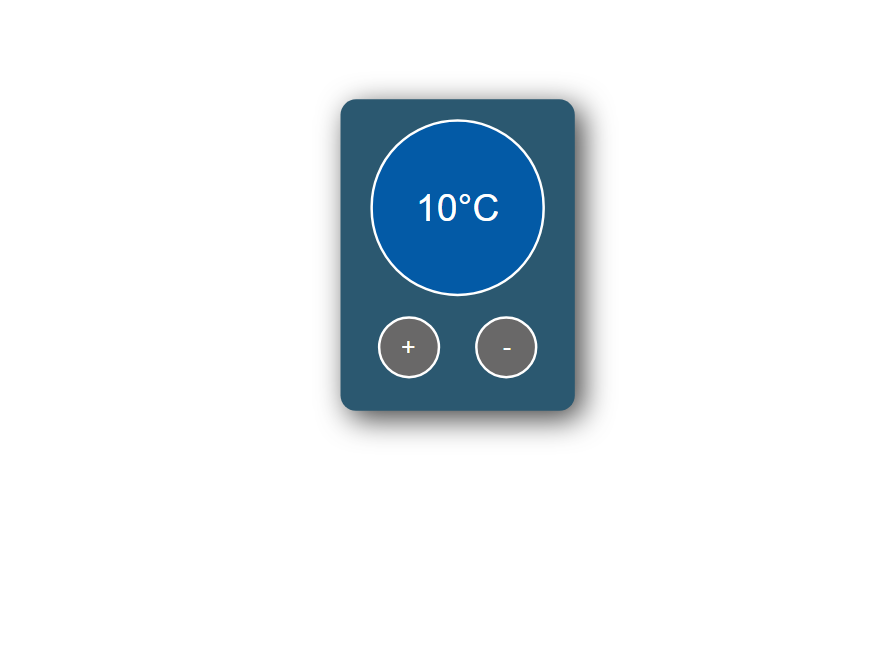
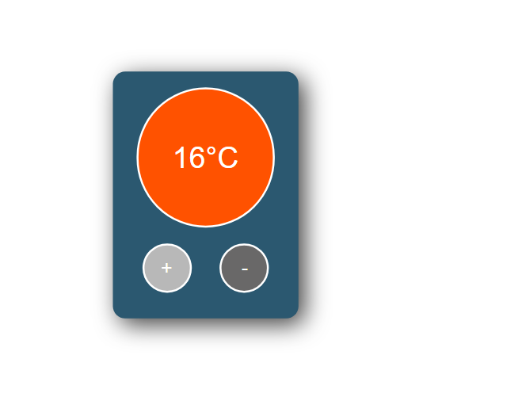
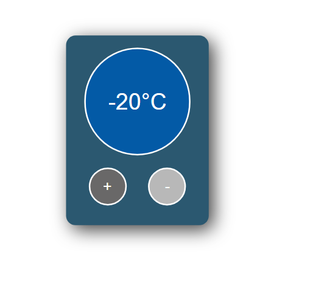
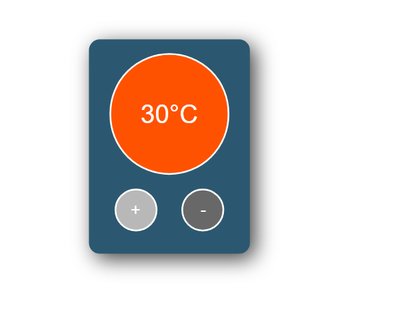

```
Tutorial Title: How to build a temperature control app in React | Beginner React Projects
Tutorial Link: https://www.youtube.com/watch?v=V3bhcxpoxQU&ab_channel=ChrisBlakely
Author: https://www.youtube.com/@ChrisBlakely

Features:

- jsx
- react components
- react state
- react hooks
- DOM
- conditionals

```





